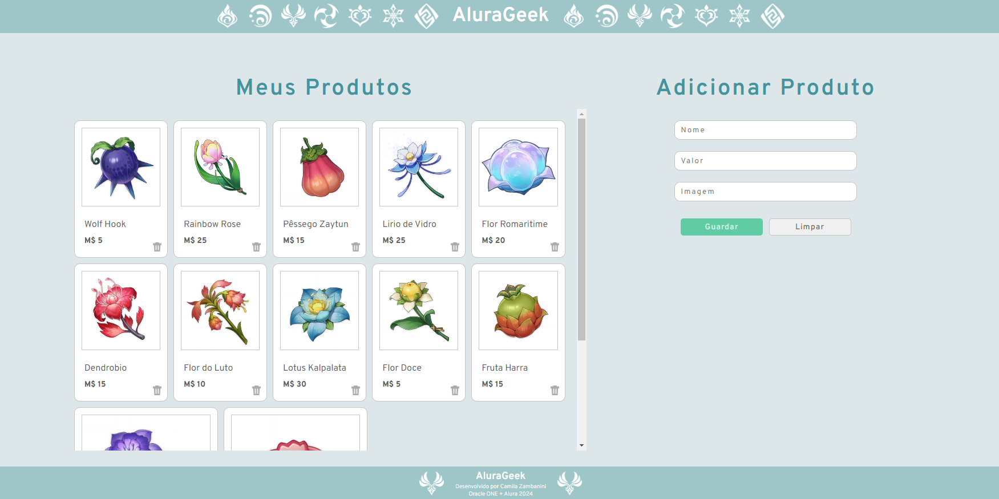

# Challenge ONE | Front End - AluraGeek

---
###  Sobre o desafio:

Desafio da trilha Formação Front End, parte do treinamento do programa ONE da Oracle 🧡

Desafio consiste em criar uma página de produtos, em que a pessoa possa adicionar e deletar os produtos, como forma de praticar o CRUD usando json-server

